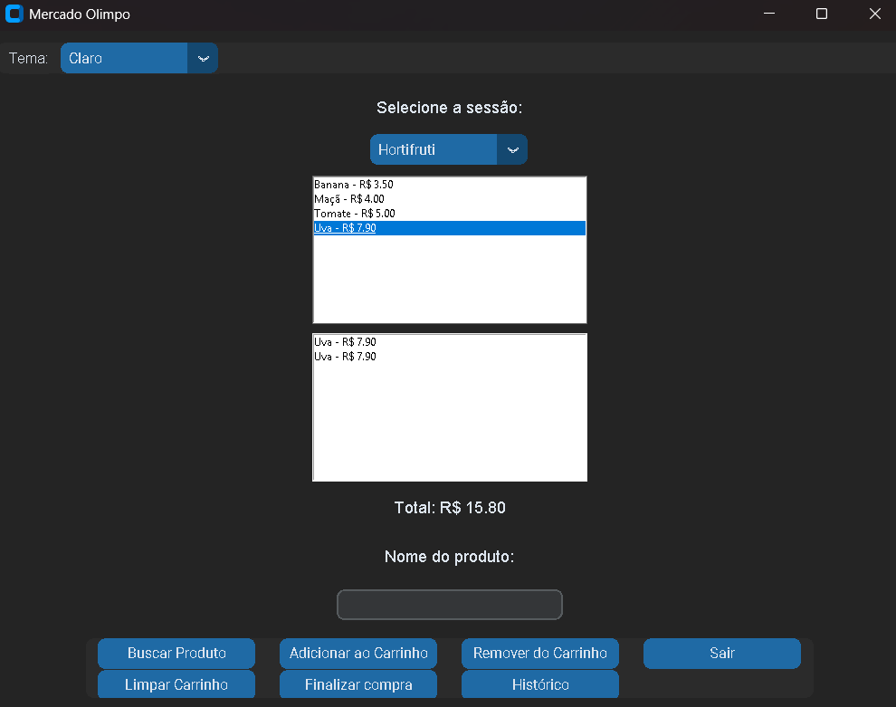
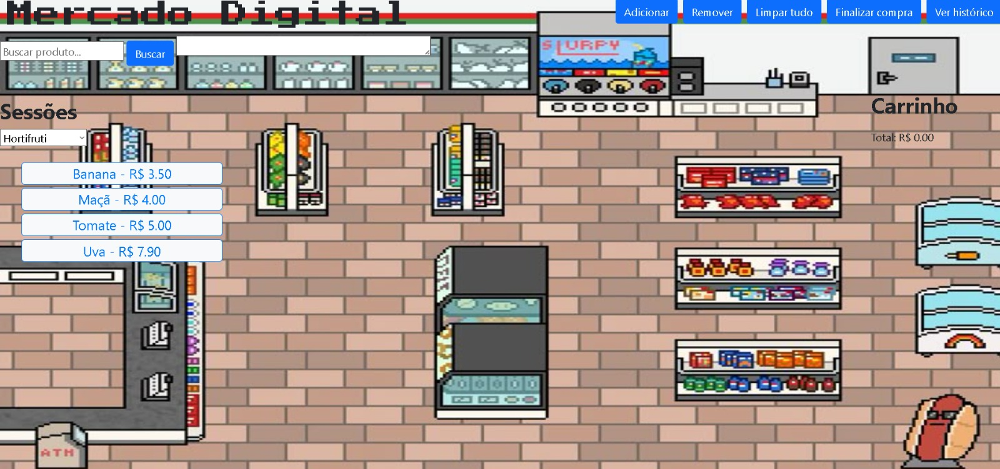
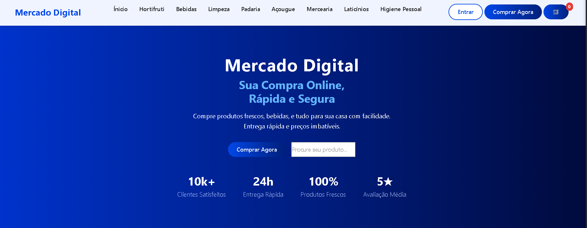
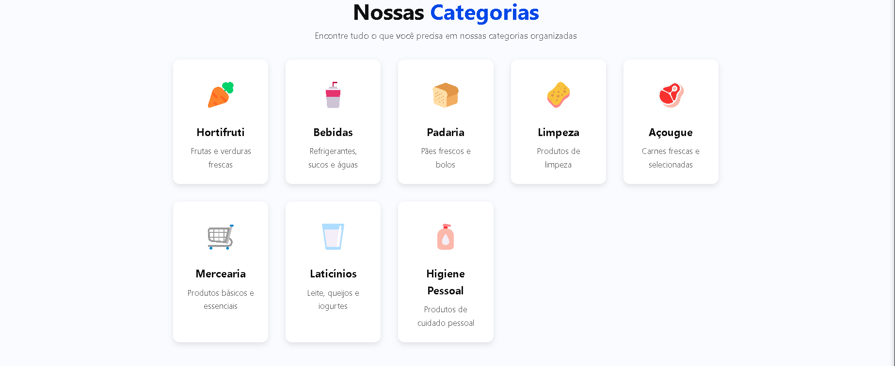

# Simula-Mercado-Digital

## Descrição do projeto
### Versão 1.0
Este é a evolução do projeto ao decorrer do desenvolvimento dele:
A primeira Imagem é refente ao código, quando utilizarmos a interface visual do Tkinter para representarmos os dados do projeto.



### Versão 2.0
O projeto, teve uma mudança gráfica, pois começamos a utilizar o framework Django, então tivemos que fazer mudanças no arquivo interno e na aparência do site, indo para uma abordagem gameficada.



### Versão 3.0
Agora o site está em sua versão final, com um design mais moderno e com sua funcionalidades novas, concluindo o objetivo do site.




Este código utiliza conceitos de estruturas de dados para realizar uma simulação de mercado, com funções de carrinhos e compras automatizadas, incluindo histórico do carrinho realizada por busca binária e utilizando conceitos como FIFO e LIFO.

O projeto conta com módulos como CustomTkinter, JSON, os, e messagebox, asgiref, beautifulsoup4, cffi, cryptography, darkdetect, Django, django-bootstrap-v5, djangorestframework, mysqlclient, packaging, pycparser, PyMySQL, soupsieve, sqlparse, typing_extensions, tzdata;


---

## Instruções de execução

Após baixar o arquivo `.zip` e descompactar, siga os passos abaixo:

### Ativar ambiente virtual (Windows PowerShell)

```powershell
.venv\Scripts\Activate.ps1
```

Caso ocorra algum erro, faça:

```powershell
deactivate
Remove-Item -Recurse -Force .venv
py --version
py -m venv .venv
.\.venv\Scripts\activate
```

### Instalação das dependências

Se estiver com o arquivo atualizado apenas baixe o requirements.txt

```bash
pip install -r requirements.txt
```
Senão baise as dependências abaixo:

```bash
pip install django
pip install django-bootstrap-v5
pip install djangorestframework mysqlclient
pip install djangorestframework
pip install pymysql
pip install cryptography
```

### Rodar o projeto

```bash
python manage.py runserver
```

---

## Tecnologias utilizadas

- Python 3.12  
- Django  
- Django REST Framework  
- Django Bootstrap 5  
- MySQL  
- CustomTkinter  
- pymysql
- JavaScript

---

## Estrutura dos arquivos

```
Simula-Mercado-Digital/
├── .venv/
├── mercado/
│   ├── __pycache__/
│   ├── migrations/
│   ├── static/
│   │   └── mercado/
│   │       ├── style.css
│   │       ├── style_hort.css
│   │       ├── scripts.js
│   │       ├── hort-produto.js
│   ├── templates/
│   │   └── mercado/
│   │       ├── index.html
│   │       ├── acougue.html
│   │       ├── bebidas.html
│   │       ├── higiene_pessoal.html
│   │       ├── hortifruti.html
│   │       ├── laticinios.html
│   │       ├── limpeza.html
│   │       ├── mercearia.html
│   │       ├── padaria.html
│   ├── __init__.py
│   ├── admin.py
│   ├── apps.py
│   ├── models.py
│   ├── serializers.py
│   ├── tests.py
│   ├── urls.py
│   ├── views.py
├── Projeto/
├── users/
├── manage.py
├── requirements.txt
├── README.md
├── LICENSE
├── exemplo1.png
├── exemplo2.jpg
├── exemplo3.png
├── exemplo4.png
             
```

---

## Configurações adicionais

- Instale o MySQL: https://dev.mysql.com/downloads/installer/  
- Instale o XAMPP e inicie o MySQL nele.  
- No MySQL, configure o usuário root sem senha (padrão).  
- Crie o banco de dados com o comando SQL:

```sql
CREATE DATABASE test_db CHARACTER SET utf8mb4 COLLATE utf8mb4_unicode_ci;
```

- Verifique se a porta MySQL no XAMPP está ativa e configurada corretamente.

---

## Integrantes do grupo

| Nome                    |
|-------------------------|
| Neyverson               |
| Ythalo                  |
| Henrique                |
| Caio Proença            |
| Gustavo Henrique Fragoso|
| Ícaro                   |
| Yuri                    | 
| Davi                    |
=======
